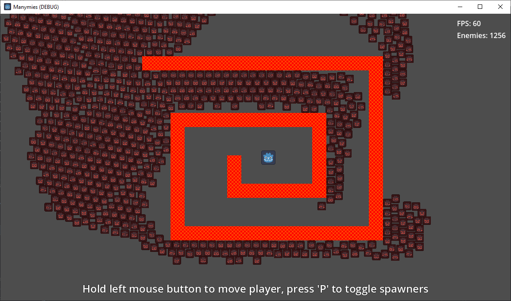

Trying to run a scene in Godot with as many enemies as possible
=============

# Features 3 solutions with 1000+ enemies at 60fps

- non-solid soft-separation ( main.tscn )
- non-solid raycast steering ( main_raycast.tscn )
- rigidibodies ( main_rigidbodies.tscn )
